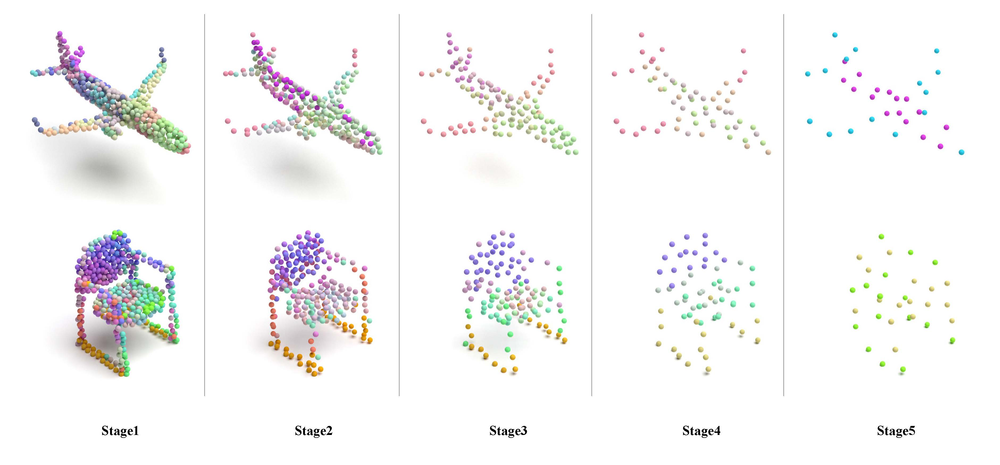

<!--
 * @Date: 2022-06-18 08:26:35
 * @Author: Liu Yahui
 * @LastEditors: Liu Yahui
 * @LastEditTime: 2022-07-02 13:58:24
-->
# PointConT
This repository is an official implementation of the following paper:
> [Point Cloud Classification Using Content-based Transformer via Clustering in Feature Space](https://arxiv.org/pdf/2303.04599v1.pdf)
>
>Yahui Liu, Bin Tian, Yisheng Lv, Lingxi Li, Feiyue Wang
>
>**Accepted for publication in the *IEEE/CAA Journal of Automatica Sinica***


## Get Started
### Installation
```
# clone this repo
git clone https://github.com/yahuiliu99/PointConT.git
cd PointConT

# create a conda env
conda create -n pointcont -y python=3.7 numpy=1.20 numba
conda activate pointcont

# install PyTorch and libs 
# please install compatible PyTorch and CUDA versions
conda install -y pytorch=1.10.1 torchvision cudatoolkit=11.1 -c pytorch -c nvidia
pip install glob, h5py, sklearn, einops, hydra-core=1.1, tqdm, warmup-scheduler, deepspeed

# install the pointnet++ library cuda extensions
pip install pointnet2_ops_lib/.
```

### Data Preparation

When you first run the command for training, the datasets will be automatically downloaded and saved in `data/`.
- **ModelNet40** -->`data/modelnet40_ply_hdf5_2048/`
- **ScanObjectNN** -->`data/h5_files/`

Alternatively, you can manually download the official data ([ModelNet40](https://shapenet.cs.stanford.edu/media/modelnet40_ply_hdf5_2048.zip) | [ScanObjectNN](https://hkust-vgd.github.io/scanobjectnn/)) in any path, and create a symbolic link to your datasets folder.
```
mkdir data
ln -s /path/to/your/data/folder data/
```

## Training
### Step 1: Check config file 
You can modify settings in `config/cls.yaml`.

Make sure the `eval` is set to False.

> We support [wandb](https://wandb.ai/site) for collecting results online. Just set `wandb.use_wandb=True` if use wandb. 
> Please check the [official wandb doc](https://docs.wandb.ai/) for more details. 

### Step 2: Train PointConT
- Classification on ModelNet40

    ```
    python main_cls.py db=modelnet40
    ```

- Classification on ScanObjectNN

    ```
    python main_cls.py db=scanobjectnn
    ```
    
`config/cls.yaml` will be automatically loaded when you run the command.


## Evaluation
To evaluate a trained-model, please set `eval=True` in `config/cls.yaml` and run `python main_cls.py db=${dataset}`

Or you can override values in the loaded config from the command line:

```
python main_cls.py db=${dataset} eval=True
```


## Visualization
### Dependency
- [Mitsuba](https://www.mitsuba-renderer.org/)

Please refer to the following github repository for point cloud rendering code: [PointFlowRenderer](https://github.com/zekunhao1995/PointFlowRenderer)



## Results (pretrained model)

| Dataset |    mAcc  |   OA   |   Download |      
| ------- | ---- | ---- | :----: | 
| ModelNet40   |   90.5   |   93.5   |   [ckpt](https://drive.google.com/file/d/1ZUrZMnqsnr2Tkqt51Aa9LPmsfQ0P3dmI/view?usp=sharing) \| [log](https://drive.google.com/file/d/14v4mmwN7qXnufIML-_1XmWU14U4eej2w/view?usp=share_link)   |      
| ScanObjectNN    |   86.0   |   88.0   |   [ckpt](https://drive.google.com/file/d/1hewKbJoERzaqY261_QQoenZ0Ni9-iYGF/view?usp=sharing) \| [log](https://drive.google.com/file/d/1s-z5quorbZUYHfTNWnevS-CA_jcy9S0F/view?usp=sharing)   |   
| ScanObjectNN *   |   88.5   |   90.3   |   [config](config/voting_cls.yaml) \| [log](https://drive.google.com/file/d/1XHQjuHzMBOciWhY7WlM6DsiaiZydrSVR/view?usp=sharing)   |      

\* denotes method evaluated with voting strategy 
## Citation

If you find our work useful in your research, please consider citing:
```
@article{Liu2023PointConT,
    author = {Liu, Yahui and Tian, Bin and Lv, Yisheng and Li, Lingxi and Wang, Feiyue},
    title = {Point Cloud Classification Using Content-based Transformer via Clustering in Feature Space},
    journal = {IEEE/CAA Journal of Automatica Sinica}, 
    year={2023},
    volume={},
    number={},
    pages={}
}
```

## Acknowledgement

Our code is mainly based on the following open-source projects. Many thanks to the authors for their wonderful works.


[PointNet2](https://github.com/erikwijmans/Pointnet2_PyTorch),  [Point-Transformers](https://github.com/qq456cvb/Point-Transformers), [DGCNN](https://github.com/AnTao97/dgcnn.pytorch), 
[CurveNet](https://github.com/tiangexiang/CurveNet), 
[PointMLP](https://github.com/ma-xu/pointMLP-pytorch), [PAConv](https://github.com/CVMI-Lab/PAConv), [PointNeXt](https://github.com/guochengqian/pointnext)


